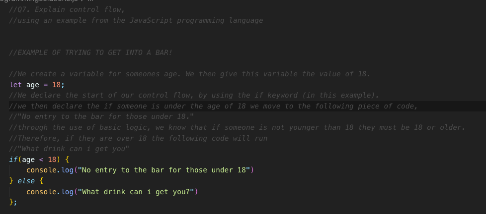
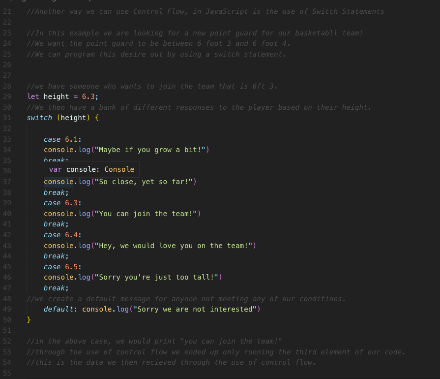
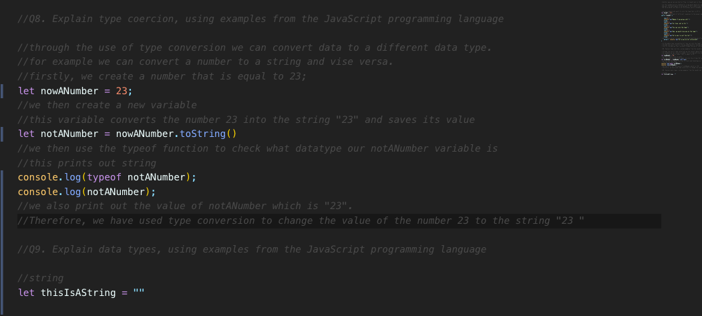
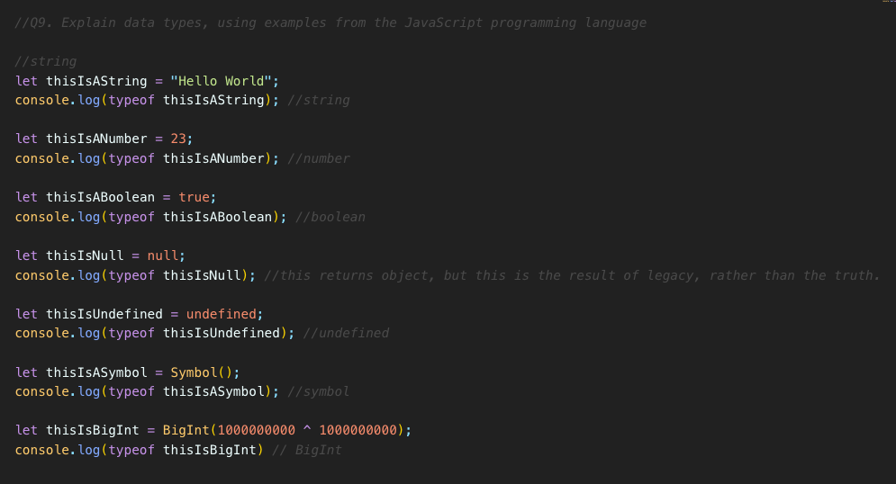
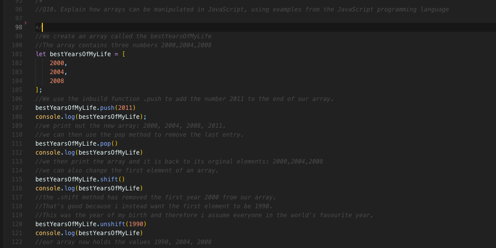
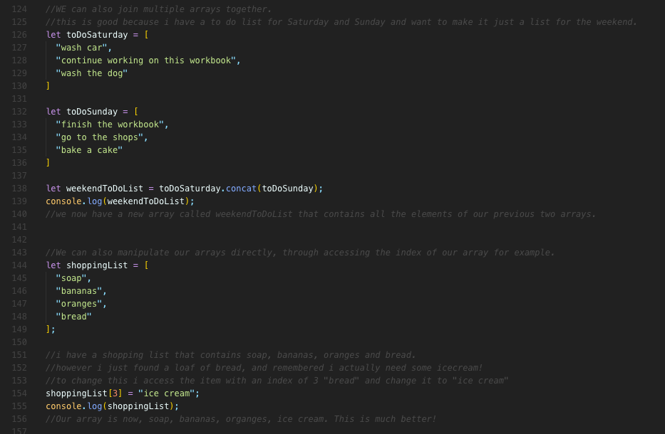
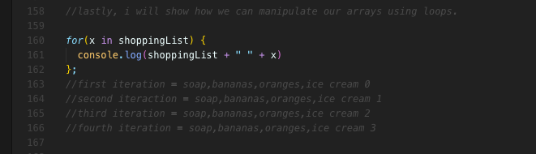

####Q1. Provide an overview and description of a standard source control process for a large project.

#####What is Source Control 

Source control, also known as version control is a way for developers to maintain their source code throughout a projects development. Source control allows programmers to keep track and manage changes to their code. 

As part of a large project, source control processes allow developers to track code changes and allows developers to use previous editions of their code if this is necessary. Version control, also allows teams to develop applications in a collaborative way while also allowing developers to work independently until they have finished a feature of their program. As this is a segment of the program, this can then be integreated into the larger projects in a more controlled way, thereby limiting potential conflicts with the larger project and making error testing and bug identification a more efficient process. 

#####My Source Control Process 

My version control process consists of two elements, GIT and the use of GITHUB. 

######GIT 

GIT is a version control system that was deployed in 2005. It is an example of a distributed version control system. This means that programmers are able to maintain a full history of the changes to their code they wish to keep. They are also able to make different versions of their code through the utilisation of branching. These branches can then eventually be merged with the master branch once new code has been created and made stable for implementation within the larger project. 

One of the key benefits of the use of GIT is that a developer may work on their projects while offline. GIT also had security benefits in that one can keep all of their code locally and therefore not subject to the security threats of the wider web if this is desirous for the developer. 

######GITHUB

GitHub is what is known as a Git repository hosting service. In contrast to GIT, GitHub is web based. This allows for developers to publish their code online. This can enable easier collaboration between developers. If a developer chooses, they can have their code published publicly. GitHub also provides a user-friendly interface for programmers to look at their programs and see the history of changes made to their code. 

One of the key features of GitHub, is forking, which allows users to copy of the code of other programmers. These facilitates collaboration and improves the ability of programmers to work in groups. 

####Q2. What are the most important aspects of quality software?

Software is an invasive force within modernity. It is for this reason that quality in terms of software is so critical. In terms of the most important aspects of quality software I would argue that reliability, security, modifiability, testability, efficiency and maintainability are most critical. 

Reliability, is the notion that the software that we create or interact with behaves in logical and consistent ways.  For our users, this means that they interact with the software in a seamless reliable way. For example, Errors should be handled and our programs should run in a consistent manner.

Security, is a metric by which we can assess the ability of our software to be protected against potential security breaches. This metric can be measured against the number and seriousness of the vulnerabilities found within software. Poor security is often the result of poor coding and overall weaknesses within the structures of our software. For example, not having proper user authentication which can make certain aspects of our application susceptible to security breaches. 

Modifiability, this is the idea by which it should be easy to change, add, update or delete elements within our software. In highly modifiable software, we are able to alter the performance of our applications with minimal changes to our programs code. For example, the ability to change what renders to our screens through the use of components in react over not using components and hardcoding each line of code. 

Testability, is the idea that our code should be easily testable in order to verify its functionality. Automated testing is an important aspect of the testability of a program. Each feature that we implement within our programs should be easily testable. We should also be able to verify that our programs are running as expected.  For example, we should run each component of our applications that contains logic through tests to insure that our program performs as we anticipate. 

Efficiency, is the use of as few resources as possible. Our programs should not have an excess of code and run as fast as possible. We should minimise API, database and external calls as much as possible. Efficiency can be seen as the antithesis of code bloat. It is similar in notion to the DRY principle in coding in that we want to be as efficient was possible with our software. 

Maintainability, is the easy by which we are able to upkeep our code. This includes the easy by which we can modify, adapt or alter our software. Software maintainability can be achieved by following company regulations and coding conventions. For example, insuring that proper indenting is applied makes ones code easier for other developers to use and therefore makes the code more maintainable over the long run. 

####Q3. Outline a standard high level structure for a MERN stack application and explain the components

What is a ‘stack?’ 

Put simply, a stack is the totality of the technologies and softwares one uses in order to create a functional web application. 

What is the ‘MERN’ stack?

There MERN stack is a JavaScript based stack that helps us developers make smooth and functional web applications. The MERN stack is comprised of four open-source elements. MongoDB, Express, REACT and Node.JS. 

Various Elements of the MERN stack Itself. 

MongoDB is a document based NoSQL database in which we can store data for later use. MongoDB is free to use. MongoDB stores data in JSON like documents. This allows our data structure to change over time. This is in contrast to other databases which store date using the row/column model. The high level components of MongoDB are the following: The database: This is where our data is stored. Each database has its own unique set of files. Multiple databases exist one a single MongoDB server.The collections: These are a groups of database documents. Our collections exist within a single database. Inside our collection, we can have a number of documents with a number of fields. However, for the most part. Our documents contained within our collect should have the same purpose. Documents: Our documents are a set of key-value pairs. Not unlike an object in Javascript. Our documents have dynamic schemas. This means that the documents with our collections don’t necessarily have to have the same structure or even contain the same data types. 

Express is fast, unopinionated, web framework for Node.js (according to express!). Express is an example of open sourced software and it built for the development of mobile and web applications. Express makes our lives as developers easier by making things more simple and improves our functionality by providing us access to HTTP utility methods and various middleware. Dynamic routes are straightforward, everything is better organised and it’s easier to implement validation and access the body of our HTTP requests. 

React is the front-end of the MERN stack. With REACT we can create single page applications (SPA) that renders content. React works by the creation of various functional and class components that are build and utilised through the use JSX and JS. We can pull any data we want for our database through the linkage of our REACT software to our NODE software. 

Node.JS is part of the backend of a MERN stack based build and works in tandem with our database (MONGODB). It is within Node.js where we set up the MERN stack and the MVC. We also use note to set up authentication for our website throughout the use of cookies and sessions. 

####Q4. A team is about to engage in a project, developing a website for a small business. What knowledge and skills would they need in order to develop the project?

As with any build, the purpose of the build and how to achieve this is always the first consideration one must have when building an application. A website for a small business could be build any number of different ways. Given, my own experience, I would likely use either Ruby on Rails or the MERN stack. In this example, I will use the MERN stack. 

Knowledge

The first thing I would do once given a brief, would be to break down what is the purpose of the build and what is the required features that the build requires in order to for me to deliver a viable product. I would articulate this need by creating documentation. 

Documentation- 
* What is the current problem with the website? 
* What is the overall goal we are trying to achieve in building a new website for this company?
* What is the purpose of our build
* What features to do need to implement?
* What functionality does the website need?
* Who is the target audience for our build?
* Create wireframes 
* Create sitemap
* What tech stack do we need to implement in order for our website to function as desired? 
* Our will our database work? 
* What are the high-level components of our application?
*  Do we need to use any third party services to deliver our project?
* How can we effectively implement the waterfall methodology in order to maximise our efficiency and deliver the best quality product to our customer? 
* ERD
People Management - 
* How can we effectively allocate the resources of our team to effectively  deliver our build? 
* What skills do we have?
* What skills do we need to learn? 
* What responsibilities do we each have in terms of the overall build? 
* Have stand-up meeting in the morning in order to efficiently allocate personal and to monitor our project. 

Skills 

In order to build a project we will require adequate skills of the MERN stack.

* What components do we need? 
* How are we going to implement our design for our website?
* Are there any Apis that we can use? 
* How best to implement our designs? 
* What data do we need in our database? 
* How are we going to structure our database? 
* Is our ERD suitable? 
* We need to link our express and react together. 
* We can use node for testing our code
* We can use node in the development of our application. 

####Q5. With reference to one of your own projects, discuss what knowledge or skills were required to complete your project, and to overcome challenges

In terms of this course, the largest build I’ve had to do so far is our two-sided marketplace application build using Ruby on Rails. For my build, i decided to make a trading platform for Australian coinage minted between 1901 and modernity. On the back of our previous assessments, a terminal application, a static website and a workbook this was a major build. 

Initially, my philosophy was to start the build and get as much done and when I ran into trouble try and solve these problems. I think this philosophy was not best for a number of reasons. Firstly, Ruby on Rails is a convention based. By rushing into programming without focusing on prioritising Rails convention I becoming increasingly inefficient as the project continued. Had I followed the ‘Rails Magic’ this would not have been the case. Secondly, I decided to build and plan as I go. This was a major error. If I had spent more time focusing on the documentation that was required and improving my knowledge of the obvious hurdles I would come across I would have developed a far better application overall. 

In terms of what knowledge was required to complete the project the following is my thoughts on the matter. 

1. I needed an understanding of the RUBY programming language. Without this, any Ruby on Rails build is impossible to complete efficiently and effectively. 
2. It was important to have an understanding of the Ruby on Rails architectural pattern, namely the MVC (model, view, controller). Without an adequate understanding of the MVC it’s impossible to use ’the rails magic’ also known as convention over configuration. 
3. In order to implement wireframes and website design within the application, I was required to know HTML5 and CSS3. 
4. In order to allow for payments and to implement security features within my website I required the use of various “gems”, which are akin to packages in Javascript. The one’s a used for my assessment where Devise (security), Heroku (deployment) and stripe (for payments). 

####Q6. With reference to one of your own projects, evaluate how effective your knowledge and skills were for this project, and suggest changes or improvements for future projects of a similar nature

Given that I answered the previous questions using my Rails application as an example, it stands to reason that I should continue with this analysis. I feel that my skills allowed me to build an application that while not perfect was adequate for my coding experience. I think that given that I prioritised building the application rather than understanding the MVC architecture and the design I need to implement for my project i end up within unnecessary difficulties as my application became more and more cumbersome. 

If I had followed Rails convention, and spend more time understanding the content initially, I think I would have got far more out of the project both from a knowledge standpoint and in terms of a final product. I think I also had a level of anxiety about my abilities which made me quick to give up on occasion. 

If given my time again, I would firstly spend far more time on the design and implementation of the document component. This would have allowed me to better understand the needs of my project and gain the knowledge I required to implement these features. I would also have spent more time going over the Rails content from class, rather than just starting a build. It would have made sense to create a repo on GitHub where I used code examples with comments for the various elements and features I required for the project to be a success. I should have also asked Hamish to do more reviews. He was happy to do them and I think my pride was often a barrier to great educational obtainment. I didn’t want to feel like I was asking stupid questions and so forth. 

I think that time management was not an issue for me per se. However, I would have been better advised to spend more time on accruing the knowledge I required for the assessment and would have benefited from a greater allocation of my time capital to documentation. 

I think I did well at prioritisation. If I was able to find a solution that worked 99% of the time, I was happy with that given our time constraints. I would then make notes to refer back to the issue if time allowed. 

Dearest of stern preceptors, i beg thee, take a break presently to admire some witticicisms from the 19th century. 

1. "See here, wait, I've found a button in my salad." "That's all right, sir, it's part of the dressing."
2. Who is the greatest chicken-killer in Shakespeare? Macbeth, because he did murder most foul.
3. Why should the number 288 never be mentioned in company? Because it is two gross.
4. Pawnbrokers prefer customers without any redeeming qualities.

Now back to the  assessment, 

####Q7. Explain control flow, using an example from the JavaScript programming language

Control flow is the method programmers use to control the order in which are statements, functions and instructions are exectued and or evaluated. We can look at control flow as a road, with different choices stemming from this road based on which path our program ends up taking. For example, 

The following answer can be, found in my programmingsolutions.js file as the first entry from lines 1 to 56. 

####Q8. Explain type coercion, using examples from the JavaScript programming language

In computer programming, type coercion is the process by which we are able to change an expression from one data type to another. This gives us much more flexibility with the use of our data and allows us to construct more holistic and complex programs. 

There are two types of data coercison in JavaScript. Implicit and Explicit. 

Implicit coercision is type conversion does implicity by Javascript. 

Explicit coercision is done explicitly in code using the inbuild functions of Javascript such as Number() and String()

The following answer can be, found in my programmingsolutions.js file as the first entry from lines 56 to 70. 

####Q9. Explain data types, using examples from the JavaScript programming language

In Javascript we have the following datatypes, 

String- strings are just pieces of text, or strings of characters wrapped in quotes either (' ' or " ")
Number- Unlike Ruby which has floats and integers, Javascript has only numbers. The number datatype in javascript, can be a positive number, negative number, integer or float. 
Boolean- These are either true of false values. We can think of them as yes or no, or 1 or 0. 
Null- Is the itentinal absense of value. The value is explicitly nothing. 
Undefined- These are variables that do not have a value assigned to them. 
Symbol- A symbol is a method for keeping data private and is for internal use only. They are often used to identify object properties. No Symbol is equal to any other symbol. 
BigInt- A built-in object that allows us to represent large numbers that are to big to be held reliably by the numbers datatype. 

We also have reference types 

Arrays- a list of different elements. Often an ordered collection of data. 
Object- a key value pairing. Often unorder collection of data.
Function- a bit of reuseable code. 

Example of Arrays, Objects and Functions can be found in my answers to later questions. 

This answer can be viewed from lines 72-95 in my programmingsolutions.js file 

####Q10. Explain how arrays can be manipulated in JavaScript, using examples from the JavaScript programming language

Arrays are just a collection of values. We can add different datatypes within our arrays. Arrays are indexed, and this helps us to be able to mainpulate our arrays. 

We can use a number of the predefined methods of JavaScript to helps us manipulate arrays. Here are some of the common one's and what they allow us to do. 

.push - adds element to the end of an array
.pop - removes element from the end of the array
.shift -  removes element from the start of the array
.unshift - removes element from the end of the array
concat - used to merge two or more arrays
reverse - mutates original array, doesn't make a copy reverse original content.
join - creates a string from an array. Taken an array and spits out a string. 
slice- take a portion of an array and makes a new array with it. 
splice- either removes element, replaces elements or adds new element to array.
.map- creates a new array with results of calling a function for every element in the array. 

besides these methods, we can also manipulate our arrays through the use of our loops and our functions. 

For answer to this question please look at programmingsolutions.js line 98 to 169. 
####Q11. Explain how objects can be manipulated in JavaScript, using examples from the JavaScript programming language

####Q12. Explain how JSON can be manipulated in JavaScript, using examples from the JavaScript programming language

####Q13. For the code snippet provided below, write comments for each line of code to explain its functionality. In your comments you must demonstrates your ability to recognise and identify functions, ranges and classes

#####SOURCES 
1. https://techcrunch.com/2012/07/14/what-exactly-is-github-anyway/
2. https://www.atlassian.com/git/tutorials/what-is-git
3. http://www.davidchappell.com/writing/white_papersThe_Three_Aspects_of_Software_Quality_v1.0-Chappell.pdf
4. https://en.wikipedia.org/wiki/Software_quality#Introduction
5. https://www.altexsoft.com/blog/engineering/what-software-quality-really-is-and-the-metrics-you-can-use-to-measure-it/
6. https://blog.hyperiondev.com/index.php/2018/09/10/everything-need-know-mern-stack/
7. https://www.mongodb.com/what-is-mongodb
8. https://intellipaat.com/blog/what-is-mongodb/#_Architecture

